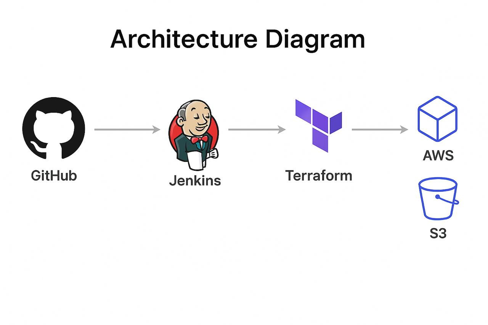

# aws-devops-pipeline

End-to-end AWS Devops CI/CD pipeline using terraform, Jenkins, and Docker to deploy a containerized Node.js app on AWS EC2.

---

# Overview
This project demonstrates an advanced DevOps pipeline that automates infrastructure provisioning, containerization, and continuous deployment on AWS using modern tools and practices.

*Key Features:*
- Infrastructure as Code (IaC) using *Terraform*
- Containerized Node.js application using *Docker*
- Automated CI/CD pipeline with *Jenkins*
- Deployment on *AWS EC2* within a custom *VPC*
- Integration with *S3* for artifact storage

---

# Architecture

The architecture consists of:
- Source code and Terraform files hosted on GitHub
- Jenkins automating the CI/CD process
- Terraform provisioning AWS resources (VPC, EC2, and S3)
- Docker container running the Node.js app on EC2 instance
- Artifacts and logs stored in S3 for traceability

---

# Architecture Diagram

---

# Tools & Technologies
AWS | Terraform | Jenkins | Docker | Node.js | GitHub | CI/CD | Infrastructure as Code (IaC)

---

# Project Files

| File | Purpose |
|------|----------|
| providers.tf | Configures AWS provider |
| variables.tf | Defines Terraform variables |
| main.tf | Infrastructure creation (EC2, S3, VPC) |
| outputs.tf | Terraform outputs |
| Dockerfile | Builds Node.js app image |

---

Created and maintained by [Akshitha Narayana](https://www.linkedin.com/in/akshitha-narayana)  
© 2025 Akshitha Narayana. All rights reserved.  
Original repository: [github.com/Akshitha315/aws-devops-pipeline](https://github.com/Akshitha315/aws-devops-pipeline)
| server.js | Sample Node.js web app |
| Jenkinsfile | Defines CI/CD pipeline |
